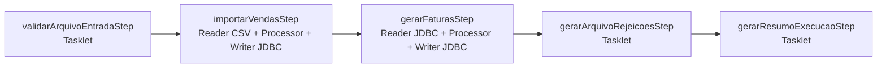

# spring-batch-processamento-faturamento

Projeto Java Spring Boot didatico e de portfolio para demonstrar processamento batch de vendas e geracao de faturas com Spring Batch.

## Objetivo

O objetivo e mostrar, em uma rotina com cara corporativa real, os principais conceitos de Spring Batch: `Job`, `Step`, `Tasklet`, chunk processing, `ItemReader`, `ItemProcessor`, `ItemWriter`, `JobParameters`, `JobRepository`, `JobExecution`, `StepExecution`, `ExecutionContext`, skip, retry, restartability, listeners e testes automatizados.

Os nomes em portugues brasileiro foram uma escolha intencional para fins didaticos.

## Problema de negocio

A empresa recebe diariamente um CSV de vendas. O batch valida o arquivo, importa vendas validas para staging, rejeita registros invalidos sem quebrar o job inteiro, gera faturas e salva um resumo da execucao.

## Arquitetura do job



## Tecnologias

- Java 17
- Spring Boot 3.5.x
- Spring Batch
- Spring Web
- JDBC API
- H2 Database em arquivo
- Flyway Migration
- Bean Validation
- Lombok
- JUnit 5
- spring-batch-test

## Como rodar

```bash
./mvnw spring-boot:run
```

No Windows:

```bash
mvnw.cmd spring-boot:run
```

O H2 em arquivo sera criado em `./data/batchdb`.

## H2 Console

Acesse:

```text
http://localhost:8080/h2-console
```

Use:

```text
JDBC URL: jdbc:h2:file:./data/batchdb;DB_CLOSE_DELAY=-1;DB_CLOSE_ON_EXIT=FALSE
User: sa
Password:
```

## Executar o job via endpoint

```bash
curl -X POST http://localhost:8080/jobs/faturamento/executar \
  -H "Content-Type: application/json" \
  -d '{"arquivoEntrada":"src/main/resources/arquivos/vendas-2026-07-05.csv","dataProcessamento":"2026-07-05"}'
```

Consultar execucoes:

```bash
curl http://localhost:8080/jobs/faturamento/execucoes
curl http://localhost:8080/jobs/faturamento/execucoes/1
```

Os parametros `arquivoEntrada` e `dataProcessamento` identificam o `JobInstance`. O projeto nao usa `run.id` aleatorio para preservar a demonstracao de restart.

## Formato do CSV

```csv
id_venda,codigo_cliente,codigo_produto,quantidade,valor_unitario,data_venda,forma_pagamento
1001,CLI-001,PROD-001,2,99.90,2026-07-05,CARTAO
```

Regras:

- `codigo_cliente` obrigatorio.
- `codigo_produto` obrigatorio e existente em `PRODUTO`.
- `quantidade` maior que zero.
- `valor_unitario` maior que zero.
- `data_venda` valida.
- `forma_pagamento` em `PIX`, `CARTAO` ou `BOLETO`.

## Tabelas

Tabelas de negocio criadas pelo Flyway:

- `PRODUTO`: cadastro inicial de produtos.
- `VENDA_STAGING`: vendas validas importadas.
- `FATURA`: faturas geradas.
- `REGISTRO_REJEITADO`: registros invalidos pulados via skip.
- `RESUMO_EXECUCAO`: consolidado final por `job_execution_id`.

O Spring Batch cria tabelas `BATCH_*`, como `BATCH_JOB_INSTANCE`, `BATCH_JOB_EXECUTION`, `BATCH_STEP_EXECUTION` e tabelas de contexto. Elas guardam metadados, parametros, status, contadores e `ExecutionContext`, permitindo rastreabilidade e restartability.

## Conceitos demonstrados

- `Job`: `jobProcessamentoFaturamento`, fluxo completo da rotina.
- `Step`: unidade de execucao, podendo ser tasklet ou chunk.
- `Tasklet`: validacao do arquivo, arquivo de rejeicoes e resumo.
- `Reader`: CSV com `FlatFileItemReader` e banco com `JdbcCursorItemReader`.
- `Processor`: validacao de venda e geracao de fatura.
- `Writer`: `JdbcBatchItemWriter` e writer customizado de faturas.
- `JobRepository`: metadados persistidos nas tabelas `BATCH_*`.
- `JobExecution` e `StepExecution`: status e contadores tecnicos.
- `ExecutionContext`: base de restart usada pelos readers com estado.
- `skip`: registros invalidos geram `RegistroVendaInvalidoException` e sao gravados em `REGISTRO_REJEITADO`.
- `retry`: `ErroTransitorioBancoException` e reexecutada ate 3 tentativas no step de faturas.
- `restartability`: uma execucao falha pode ser retomada com os mesmos `JobParameters`.

## Consultas uteis no H2

```sql
SELECT * FROM PRODUTO;
SELECT * FROM VENDA_STAGING;
SELECT * FROM FATURA;
SELECT * FROM REGISTRO_REJEITADO;
SELECT * FROM RESUMO_EXECUCAO;
SELECT * FROM BATCH_JOB_EXECUTION ORDER BY JOB_EXECUTION_ID DESC;
SELECT * FROM BATCH_STEP_EXECUTION ORDER BY STEP_EXECUTION_ID DESC;
```

## Testar rejeicoes

Execute o endpoint com o arquivo `src/main/resources/arquivos/vendas-2026-07-05.csv`. Ele possui registros invalidos de cliente vazio, produto inexistente, quantidade negativa e valor zerado. O job deve finalizar `COMPLETED`, gravando vendas validas e rejeicoes.

O arquivo de saida sera gerado em:

```text
output/rejeicoes-2026-07-05.csv
```

## Testar retry

Habilite a propriedade:

```yaml
batch:
  faturamento:
    simular-erro-transitorio: true
    id-venda-erro-transitorio: 1002
```

Ao processar a venda `1002`, o `ProcessadorGeracaoFatura` falha duas vezes com `ErroTransitorioBancoException` e deve concluir na terceira tentativa dentro do `retryLimit: 3`.

## Testar restart

Para simular falha antes de concluir:

1. Habilite uma falha controlada ou interrompa a aplicacao durante a execucao.
2. Confira a execucao em `BATCH_JOB_EXECUTION` e `BATCH_STEP_EXECUTION`.
3. Execute novamente o endpoint com os mesmos `arquivoEntrada` e `dataProcessamento`.
4. O Spring Batch deve continuar a mesma instancia a partir dos metadados persistidos.

Se uma carga ja terminou `COMPLETED`, o Spring Batch nao executa novamente o mesmo `JobInstance`. Para nova carga, altere algum parametro identificador, como `dataProcessamento`, ou limpe os dados/metadados em ambiente local.

## Testes

```bash
./mvnw test
```

No Windows:

```bash
mvnw.cmd test
```

Os testes cobrem processador de validacao, tasklet de arquivo, job completo e continuidade do job com registros invalidos.

## Melhorias futuras

- Politica de limpeza de dados por carga.
- Relatorio CSV de faturas geradas.
- Parametro para escolher diretorio de saida.
- Teste automatizado mais profundo de restart com falha induzida.
- Mais validacoes de duplicidade de `id_venda`.
